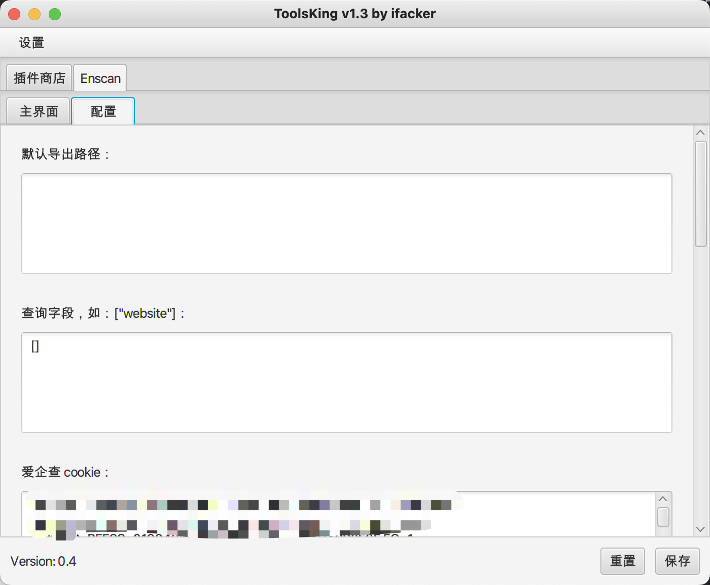

# 插件开发手册  
  
---   
⚠️ 本程序是使用 jdk1.8 开发  
⚠️ ToolsKing-1.0.jar 为启动器，后续我还会去开发一些插件，放进插件商店中，大家如果有兴趣，写的插件，可以联系我，添加进插件商店中  

## 免责声明：
本网络安全工具仅用于提供技术支持，不涉及任何应用或商业行为。用户在使用本网络安全工具的过程中，不得以任何方式损害他人的合法权益。

该工具的运行仅依赖用户提供的信息，并不包括任何违反相关法律法规的内容。用户在使用本网络安全工具时，必须确保其提供的信息合法、有效、真实可靠，否则可能会产生不利后果。

本软件提供的服务仅供参考，不构成任何责任。用户在使用本网络安全工具时，应自行承担有关安全风险。我们并不对使用者使用本工具所涉及的任何技术服务承担任何义务或责任，无论此类技术服务是否有任何损失和/或损害。  


## 主程序界面


## 创建主函数入口的包名
开发插件的主目录应在 plugins 下，命名目录为程序的名称，如下图：
  

## 修改 pom 文件
在之后编译的时候，需要修改 pom.xml 文件中的包名，如下图：
  

## 开发主函数
开发主函数的时候，如下图，有两个函数
 
分别为：`getName` 和 `getContent`
### getName
主要放置插件标签页内的名称 'title' 
### getContent
主要放置后续开发的主程序的代码

## 开发注意事项⚠️
在开发 http 这类网络 🛜 请求的时候，推荐使用 okhttp3,如下图：

本程序内置了代理，包含 http/socks5，所以如果需要发起网络请求，推荐使用如下代码：
```java
        // 创建 client 
        OkHttpClient client = new ProxyInternet().newClient();

        // 创建 HTTP 请求
        Request request = new Request.Builder()
        .url("https://www.baidu.com")
        .build();

        Response response = null;
        try {
        // 发送请求
        response = client.newCall(request).execute();
        // 处理响应
        System.out.println(response.body().string());

        } catch (IOException e) {
        e.printStackTrace();
        }
```
使用这个代码创建的请求，会自动跟随主程序设置的代理进行请求

### 测试运行
如需测试运行，可以在 runTest 目录下的 Main 函数处启动，如图，修改创建对象的包名即可：  
  

启动后，如下图所示：  


--- 
最后，如果有不明白的，可以提 issues